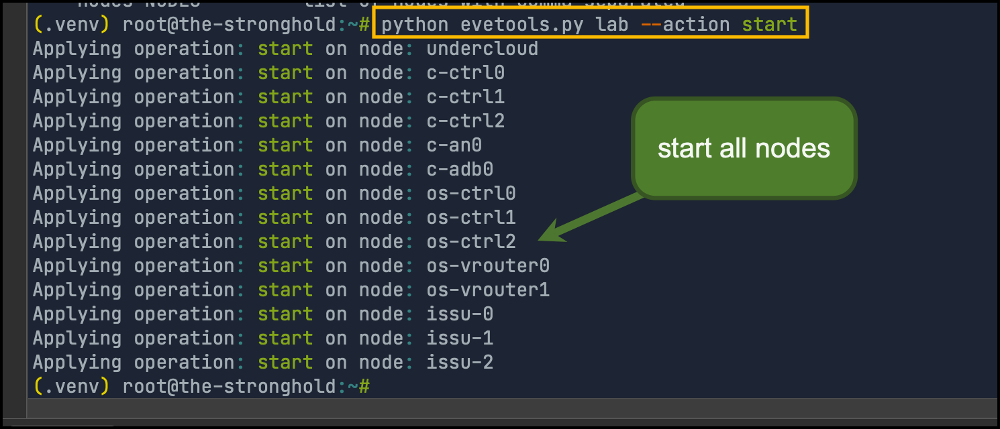
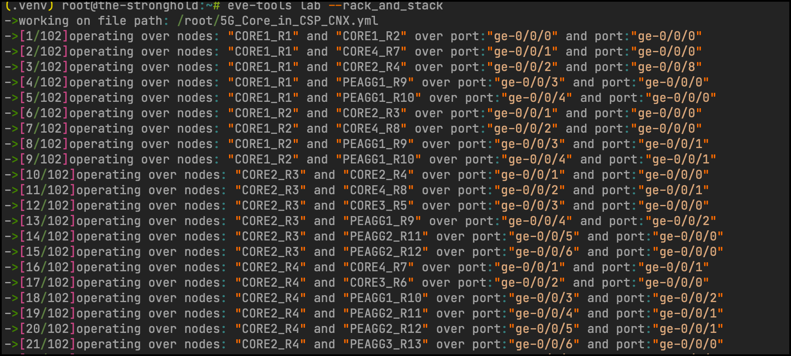
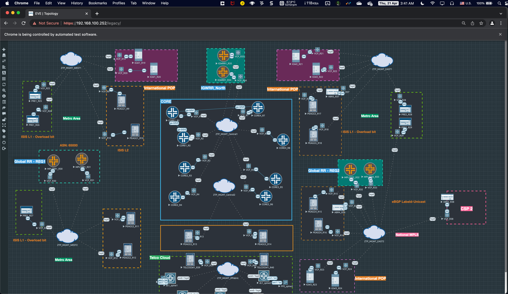
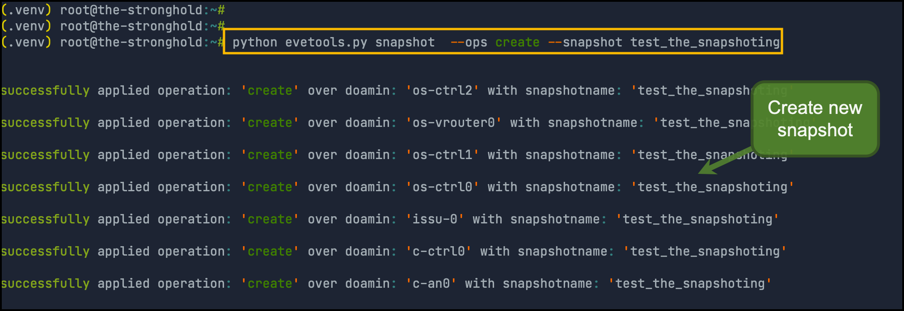

# eve-ng-tools

EVE-NG tools, A Utility to make operations with EVE-NG more friendly. Also it support different snapshot operations with same style as Libvirt/KVM


Also, this tool could be used to assist in migration from KVM to EVE-NG. Full details are described here\

https://basimaly.wordpress.com/2022/02/01/migrating-from-kvm-to-eve-ng/


# Installation

The tool need to be hosted on the eve-ng server since it use some local commands to collect data. so please execute the below commands on the eve-ng server


## Create virtualenv

```bash
virtualenv --python /usr/bin/python3.10  .venv # use python version > 3.5
source .venv/bin/activate
```


## Clone Repo and install requirements

```bash

git clone https://github.com/TheNetworker/eve-ng-tools.git
cd eve-ng-tools
pip install -r requirements.txt

```


## Create lab env

```bash
cat << 'EOF' > /root/telco_lab.env 
for key in $( set | awk '{FS="="}  /^eve_/ {print $1}' ); do unset $key ; done
export eve_ip=192.168.100.252 #<-- Provide here the eve_ip address
export eve_user=admin
export eve_password=eve
export eve_lab_name=5G_Core_in_CSP.unl
export eve_lab_cnx_file="/root/5G_Core_in_CSP_CNX.yml"

#export eve_nodes_spec="linux1:30G,linux2:40G"
#export eve_nodes_spec="ubuntu_vm:10G,ubuntu2:10G,CentOS1:10G"

EOF

source /root/telco_lab.env
```


# Supported Operations

Two operations are currently supported

- Lab operations
- Snapshot operations


## Lab Operations: 

```bash
python evetools.py lab -h
usage: eve lab [-h] [--describe | --rack_and_stack | --cnx_body CNX_BODY | --de_rack_and_stack | --get_ansible_data] [--action {start,stop,list,init}] [--nodes NODES]

options:
  -h, --help            show this help message and exit
  --describe            Describe the lab
  --rack_and_stack      Connect the nodes with each other according to the topology file stored in env variable eve_lab_cnx_file
  --cnx_body CNX_BODY   provide the body of the connection request
  --de_rack_and_stack   disconnect the nodes from each other according to the topology file stored in env variable eve_lab_cnx_file
  --get_ansible_data    Get the data required by ansible playbooks to configure Day1 according to the topology file stored in env variable eve_lab_cnx_file

  --action {start,stop,list,init}
                        Do operation over nodes
  --nodes NODES         list of nodes with comma separated
```


**Describe Lab**

```bash
python evetools.py lab --describe 
```


**Start all nodes in the lab**

```bash
python evetools.py lab --action start
```





**Stop some nodes** (omit `**--nodes**` to stop all of them)

```bash
python evetools.py lab --action stop --nodes issu-0,issu-1
```


**[new] Rack and Stack nodes**

```sh
python evetools.py lab --rack_and_stack
```

This operation will read the connection file defined in lab env `eve_lab_cnx_file` (Please see file
named `5G_Core_in_CSP_CNX.yml` for an example of connection) and will connect them according to the cable plan. Very
useful for architects exploring new design patterns or testing dramatic network changes. This operation is *idempotent*
. meaning you can run it multiple times and you will get the same result at the end.

Please see the below demo fro more infomration

*Video*

[](https://youtu.be/0zVloOPgIFk)

*CLI*



*Topology **before** the racking and stacking connection*



*Topology **after** the racking and stacking connection*


> [1] Please note the operation takes some time due to EVE-NG backend validation


> [2] Important: Please don't login to EVE-NG GUI until this operation is finished to avoid interrupting the API


**[new] Connect only one cable**

```sh
python evetools.py lab '{json_payload}'


EX:
python evetools.py lab --cnx_body '{ "src_node": "IGW2_R21" , "dst_node": "IGWRR1_R34" , "src_intf": "ge-0/0/2" ,"dst_intf": "ge-0/0/2"}'
```

This feature is a subset for the previous feature and will only connect two nodes with a single connection. useful for
adding missing connections without need to repeat pushing the full cable plan one more time.

**[new] De-Rack and Stack nodes**

```sh
python evetools.py lab --de_rack_and_stack
```

The opposite of previous feature, obviously!. it will remove the disconnect the nodes from each other this time

**[new] Get Ansible Data**

To be explained

**[new] Adjust Qcow2 VM size**

To be explained

## Snapshot operations

```bash
python evetools.py snapshot -h
usage: eve snapshot [-h] [--list] [--ops {create,revert,delete}] [--snapshot SNAPSHOT] [--nodes NODES]

options:
  -h, --help            show this help message and exit

  --list                list a snapshot

  --ops {create,revert,delete}
                        Create a snapshot
  --snapshot SNAPSHOT   snapshot name
  --nodes NODES         list of nodes with comma separated
```


**Listing Snapshots**

```sh
python evetools.py snapshot --list
```


**Creating new snapshot**

```bash
python evetools.py snapshot --ops create --snapshot test_the_snapshoting
```




**Deleting snapshots**

```bash
python evetools.py snapshot --ops delete --snapshot test_the_snapshoting
```


**Reverting  the snapshot**

```bash
python evetools.py snapshot --ops revert --snapshot test_the_snapshoting
```


## Questions/Discussion

If you find an issue with eve-tools, then you can open an issue on this projects issue page here: https://github.com/TheNetworker/eve-ng-tools/issues


## Suggestion and Feedback

[Click here](mailto:babdelmageed@juniper.net) if you have any feedback or suggestions.


